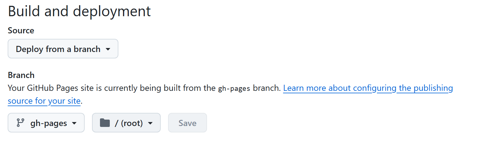

3月底就开始在部署，过了整整一个月才有了眉目。、

怎么说呢，还是学习习惯和态度的问题。其实并不是很难（~~事后诸葛亮~~），但是一直耽于不理解实现的逻辑和不了解实现的各处细节，导致之前的部署一直报错或者没能实现理想的功能。

优秀的学习过程需要产生理解，不管正确与否，理！解！

Github Action可以完成很多自动化部署。在触发条件后，github可以通过脚本将本应在本地运行的指令放到它的服务器上完成，这样的话就能减少我们的工作量。在博客部署方面它的表现就是把hexo手动部署的步骤和操作全部自动化，虽然博客的更新工作体量小，但是同样具有便捷性。

我的部署过程主要基于这篇文章：[GitHub Actions 来自动部署 Hexo](https://zhuanlan.zhihu.com/p/170563000)

# GitHub pages 与本地设置

```yml
deploy:
  type: git
  repo: git@github.com:bcuej/bcuej.github.io.git
  branch: gh-pages
```
因为我的博客静态文件存放在 gh-pages 分支，所以这里设置为 gh-pages，同时GitHub page也要保持一样的设置。


# 配置密钥

## 生成公钥私钥
```
ssh-keygen -t ed25519 -C "your_email@example.com"

// 如果系统不支持 Ed25519 算法
ssh-keygen -t rsa -b 4096 -C "your_email@example.com"
```
在git bash执行上述命令过后，可以在本地（e.g. C:\Users\xxx\\.ssh）查看 id_rsa 和 id_rsa.pub 两个文件。

## 配置到GitHub

私钥：用于触发 GitHub Actions
公钥：用于博客部署的写入

因为我的博客源码和静态文件放在同一仓库中，所以只需要对同一个仓库进行设置即可。

### 私钥

<code> 仓库 -> Settings -> Secrets and variables -> Actions -> New repository secret </code>

然后将 <code>id_rsa</code>中的值添加到 <code>Secret</code> 中，并注意 <code>Name</code> 的命名（即 **DEPLOY_TOKEN**）要和后面的workflow中的key变量名称保持一致。

添加完成后be like:


### 公钥

<code> 仓库 -> Settings -> Deploy keys -> Add deploy key </code>

Key中填写 <code>id_rsa.pub</code> 中的内容。

注意一定要勾选 <code>Allow write access</code>

# Workflow

在 <code>.github/workflow</code> 路径下添加 .yml 文件。

workflow文件的层级逻辑：


- workflow 文件命名

```yml
name: Deploy Hexo to GitHub Pages 
```

- 触发工作流

```yml
on:
  push:
    branches: [main] #选择要push的分支
```
当有人 push 代码到 main 分支时，就会触发执行这个 GitHub Actions 的工作流。而如果并未push到main分支时，就不会触发该工作流。 

📓 为什么是有人呢？
因为在 GitHub 大型项目中通常是多人协作，仓库中会有不同的提交或者拉取等操作。

- 具体 workflow 设置

```yml
jobs:
  hexo-deployment: #jobs命名
    runs-on: ubuntu-latest #指定运行的机器系统
    env:
      TZ: Asia/Shanghai #设置环境变量——时区
```

```yml
steps:
- name: Checkout source #每个step的名称
      uses: actions/checkout@v3 #每个step对应的action。
```
这些action可以从github提供的action插件获取。Action的命令已经编写好，直接引用即可。

## 完整的workflow 配置

```yml
name: Deploy Hexo to GitHub Pages

on:
  push:
    branches: [main]  # 注意这里是监听主分支（源代码分支），所以 push 后面填的是 main 分支

jobs:
  hexo-deployment:
    runs-on: ubuntu-latest
    env:
      TZ: Asia/Shanghai

    steps:
    - name: Checkout source
      uses: actions/checkout@v3

    - name: Setup Node.js
      uses: actions/setup-node@v3
      with:
        node-version: '18' #版本18较为稳定

    - name: Install pandoc #这一段是博客某些功能所需，如果博客中不需要用到 pandoc 插件可不用安装。
      run: |
        sudo apt-get update
        sudo apt-get install -y pandoc

    - name: Install dependencies & Generate static files
      run: |
        npm i -g hexo-cli
        npm install
        hexo clean
        hexo generate

    - name: Deploy to GitHub Pages
      uses: peaceiris/actions-gh-pages@v3
      with:
        github_token: ${{ secrets.DEPLOY_TOKEN }} #这里的secrets.DEPLOY_TOKEN 即是之前添加的私钥。
        publish_branch: gh-pages #这里是GitHub pages的推送分支。
        publish_dir: ./public
        keep_files: true

```

# 触发自动化部署

``` bash
git add . # 将改动的文件添加到暂存区
git commite -m "updating blog"
git push origin main

```
可以通过 git branch 查看仓库分支，绿色字体的为目前所在分支。git push origin xxbranch 能精准推送到你需求的分支。

📓 note 为什么是 origin ？
git clone https://github.com/username/repo.git
执行上述命令过后 GitHub 会把上述仓库默认命名为 origin


# 让我们试一试
Unfortunately, 出现了下述报错


报错显示出现了一个未知的块标签：unknown block tag: note

最简单的方法就是把该标签删掉，但是就会失去很多博客的可玩性。

我们选择安装依赖 <code>hexo-tag-note</code>

在 package.json 中的 dependencies 里添加该依赖
```json
"dependencies": {
  "hexo-tag-note": "^1.0.0",
}
```

让我们再试一次。

好的再次失败。因为原生主题可能不支持这个语法或者是因为GitHub提供的action中并不包含这个插件，所以我们还是选择舍弃一些趣味性吧。

删掉之后，我们再试一次。

又出现了新的报错。


发现是 原本配置的公钥和私钥失效了。再重复之前的配置步骤即可。
